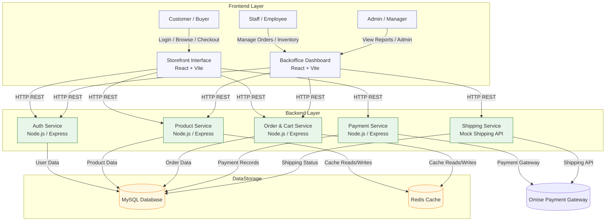

## ชื่อโครงการ ระบบร้านขายแผ่นและตลับเกม (Game Disc and Cartridge E-Commerce System)

## ข้อมูลสมาชิกทีม

| เลขประจำตัว | ชื่อและนามสกุล | บทบาทที่รับผิดชอบ |
|---|---|---|
| 67117502 | ชนันธร สะอาดจินดา | Project Manager / System Analyst |
| 67168514 | ปิยะบุตร อิ่มทอง | Customer / Database Administrator |
| 67151039 | ณัฐดนัย แสงศรี | Customer |
| 67163266 | สิรภพ อ่วมแก้ว | Staff |
| 67173119 | สุวิจักขณ์ ทัพเจริญ | Manager |

### 1. หลักการและเหตุผล (Rationale)

ในปัจจุบันอุตสาหกรรมเกมมีการเติบโตอย่างต่อเนื่อง แม้ว่าการซื้อขายเกมในรูปแบบดิจิทัลดาวน์โหลด (Digital Download) จะได้รับความนิยม แต่ความต้องการในการซื้อขายแผ่นเกมและตลับเกมในรูปแบบรูปธรรม (Physical Copy) ทั้งในกลุ่มเกมเมอร์ยุคใหม่และกลุ่มนักสะสมเกมคลาสสิก (Retro Gamers) ยังคงมีมูลค่าการตลาดที่สูงมาก ปัญหาที่พบในปัจจุบันคือ ร้านขายแผ่นเกมส่วนใหญ่อาจยังไม่มีระบบการจัดการสินค้าออนไลน์ที่มีประสิทธิภาพเพียงพอ หรือแพลตฟอร์ม E-commerce ทั่วไปไม่มีการจัดหมวดหมู่ที่ตอบโจทย์เฉพาะกลุ่มผู้เล่นและนักสะสม เช่น การระบุแพลตฟอร์ม (Platform), โซนของแผ่นเกม (Zone), แนวเกม (Genre) และความหายากของตลับเกมเก่าอย่างชัดเจน

นอกจากนี้ การบริหารจัดการหลังร้านสำหรับผู้ประกอบการยังมีความยุ่งยากในการตัดสต็อก การติดตามสถานะการจัดส่ง และการสรุปยอดขาย ดังนั้น ผู้จัดทำจึงมีแนวคิดที่จะพัฒนา "ระบบร้านขายแผ่นและตลับเกม" ซึ่งเป็นระบบ E-Commerce ที่ออกแบบมาเพื่อตอบสนองความต้องการของร้านขายเกมโดยเฉพาะ เพื่ออำนวยความสะดวกให้แก่ลูกค้าในการค้นหาและสั่งซื้อสินค้า และช่วยให้พนักงานและผู้จัดการสามารถบริหารจัดการสินค้า สต็อก ออเดอร์ และดูรายงานยอดขายได้อย่างเป็นระบบและมีประสิทธิภาพสูงสุด

### 2. วัตถุประสงค์ของโครงการ (Objectives)

1.	เพื่อพัฒาระบบพาณิชย์อิเล็กทรอนิกส์ (E-Commerce) สำหรับร้านขายแผ่นและตลับเกม ทั้งแพลตฟอร์มยุคปัจจุบันและยุคคลาสสิก
2.	เพื่อสร้างระบบการจัดการข้อมูลสินค้า (Product Management) ที่สามารถแบ่งหมวดหมู่และรายละเอียดเฉพาะของแผ่นและตลับเกมได้อย่างเป็นระบบ
3.	เพื่อพัฒนาระบบจัดการคำสั่งซื้อ (Order Management) และจำลองการติดตามสถานะการจัดส่งพัสดุ (Mock Shipping API) ที่ช่วยให้กระบวนการซื้อขายครบวงจร
4.	เพื่อสร้างระบบรายงานยอดขาย (Revenue Dashboard) สำหรับผู้บริหาร เพื่อนำข้อมูลไปใช้ในการวิเคราะห์และวางแผนการตลาด
5.	เพื่อศึกษาและประยุกต์ใช้ความรู้ด้านการพัฒนาระบบซอฟต์แวร์ตามวงจรการพัฒนาระบบ (SDLC) ในสถานการณ์จำลองจริง

### 3. ขอบเขตของระบบ (System Scope)

ผู้ใช้งาน (Actors) และความสามารถหลักของระบบ (Main Functions):

1. ลูกค้า (Customer) - ผู้ซื้อ

- ระบบสมาชิก (Register / Login)

- ระบบค้นหาและคัดกรองสินค้าแบบละเอียด (Advanced Filter)

- ระบบรายการสินค้าที่ชอบ (Add / Delete)

- ระบบตะกร้าสินค้า (Add / Edit / Delete)

- ระบบการชำระเงินออนไลน์

- ระบบติดตามสถานะการจัดส่งพัสดุ (Mock Shipping API)

2. พนักงาน (Staff) - ผู้ดูแลการจัดส่งสต็อกและออเดอร์

- ระบบเข้าสู่ระบบ (Login)

- ะบบจัดการข้อมูลสินค้าและสต็อก (Add / Edit / Delete)

- ระบบจัดการคำสั่งซื้อและอัปเดตสถานะการจัดส่ง (Edit / Update)

3. ผู้จัดการ (Manager) - ผู้ดูแลระบบ / Admin

- ระบบเข้าสู่ระบบ (Login)

- ระบบรายงานยอดขายและสถิติ (Revenue Dashboard) - ดูภาพรวมรายได้ ดูสถิติคำสั่งซื้อ สัดส่วนยอดขายตามแพลตฟอร์ม และอันดับเกมขายดี 

- ระบบแจ้งเตือนสินค้าใกล้หมดสต็อก (Low Stock Alert System)

- ระบบจัดการบัญชีผู้ใช้งาน (User Management) - จัดการบัญชีของพนักงานและลูกค้า (Add / Edit / Delete)

- ระบบจัดการโปรโมชันและคูปองส่วนลด (Promotions & Coupons) (Add / Edit / Delete)

- ระบบตั้งค่าข้อมูลหลักของร้าน (System Settings) - จัดการหมวดหมู่ แพลตฟอร์ม และแนวเกม (Add / Edit / Delete)

- สิทธิ์การทำงานครอบคลุมพนักงาน (Staff Override) - สามารถจัดการข้อมูลสินค้า สต็อก และคำสั่งซื้อได้ทั้งหมด (Add / Edit / Delete / Update) 

### 4. แนวทางการพัฒนาตาม SDLC (System Development Life Cycle)

| ขั้นตอน (Phase) | รายละเอียดโดยย่อ (Brief Description) | 
|---|---|
| 1.Planing | วิเคราะห์ความต้องการและกำหนดขอบเขตของระบบ | 
| 2.Analysis | วิเคราะห์กระบวนการทำงานและจำลองระบบ (Use Case, ER-Diagram) |
| 3.Design | ออกแบบสถาปัตยกรรมระบบ ฐานข้อมูล และหน้าจอผู้ใช้งาน (UI/UX) |
| 4.Development	| พัฒนา Frontend ด้วย React และ HTML/CSS พร้อมพัฒนา Backend API ด้วย Node.js โดยควบคุมเวอร์ชั่นโค้ดผ่าน GitHub |
| 5.Testing	| ทดสอบการทำงานแบบ Manual Testing, ตรวจสอบ API ด้วย Postman และทำการทดสอบการยอมรับของผู้ใช้ |
| 6.Deployment | นำระบบขึ้นเผยแพร่ (Deploy) ให้ใช้งานได้จริง |
| 7.Maintenance	| บำรุงรักษาและปรับปรุงระบบตามข้อเสนอแนะ |

### 5. เครื่องมือและเทคโนโลยีที่ใช้ (Tools & Technologies)
(รายการนี้สถานะไม่คงที่ และอาจเปลี่ยนแปลงได้ในอนาคต)

ส่วนหน้า (Frontend)

- NodeJS: รันไทม์สำหรับภาษาโปรแกรม JavaScript (ใช้ระหว่างพัฒนา)
- TypeScript: ภาษาเพิ่มเติมจาก JavaScript 
  ที่ช่วยจับข้อผิดพลาดผ่าน Type-Checking และ Interface
- Vite: เครื่องมือในการสร้างเว็บไซต์และรันเซิร์ฟเวอร์ในระหว่างการพัฒนา (Development Server),
- React: ไลบรารีอำนวยความสะดวกในการสร้าง UI ผ่านแนวคิดส่วนประกอบ (Component)
- Styled Components: อำนวยความสะดวกในการใช้งาน CSS ร่วมกับ React
- ESLint: ตรวจจับความผิดพลาดเชิงตรรกะในโค้ด

ส่วนหลัง (Backend)

- Node.js: รันไทม์สำหรับภาษาโปรแกรม JavaScript
- TypeScript: ภาษาเพิ่มเติมจาก JavaScript 
  ที่ช่วยจับข้อผิดพลาดผ่าน Type-Checking และ Interface
- Express: ระบบจัดการเชื่อมต่อระหว่างผู้ใช้บน HTTP/HTTPS
- Express RateLimit: เพิ่มการจำกัดเข้าถึงทรัพยากรบนเซิร์ฟเวอร์ด้วยช่วงเวลา
- Cors: เพิ่มการจำกัดเข้าถึงทรัพยากรบนเซิร์ฟเวอร์กับผู้ใช้บางส่วน
- Compression: เพิ่มการบีบอัดข้อมูลระหว่างการเชื่อมต่อกับเซิร์ฟเวอร์
- ESLint: ตรวจจับความผิดพลาดเชิงตรรกะในโค็ด
- Nodemon: อำนวยความสำดวกในการพัฒนาระบบ

ส่วนข้อมูล (Database)

- MySQL: สำหรับการจัดเก็บข้อมูลผู้ใช้, ข้อมูลสินค้า, ข้อมูลชำระเงิน,
  ข้อมูลจัดส่ง, ประวัติ, และรวมไปถึงกิจกรรมระบบ
- Redis: สำหรับการแคชข้อมูลที่ใช้งานบ่อยเพื่อเพิ่มประสิทธิภาพระบบ

ส่วนออกแบบ (Design Tool)
- Draw.io, Mermaid : ใช้งานสำหรับการเขียนวาดภาพไดอะแกรม 
Use Cases Diagram, Sequences Diagram

### 6. แนวทางการทดสอบระบบ (Testing Approach)

•	ประเภทการทดสอบ (Test Types):Functional Testing
•	User Acceptance Testing (UAT)
เครื่องมือที่ใช้ (Tools):
•	Postman (สำหรับทดสอบ API)
•	Manual Testing (ทดสอบการทำงานของระบบด้วยตนเองตามฟังก์ชันที่พัฒนา)
### 7. ผลลัพธ์ที่คาดว่าจะได้รับ (Expected Outcomes)

1.	ได้ระบบร้านขายแผ่นและตลับเกม (E-Commerce) ที่สามารถใช้งานได้จริงผ่านเว็บเบราว์เซอร์
2.	ลูกค้าสามารถค้นหาสินค้า สั่งซื้อ และติดตามสถานการณ์จัดส่งได้อย่างสะดวกและรวดเร็ว
3.	พนักงานมีเครื่องมือที่ช่วยในการจัดการสต็อกสินค้าและสถานะคำสั่งซื้อได้อย่างถูกต้องแม่นยำ ลดข้อผิดพลาดในการทำงานผู้จัดการมีระบบสรุปข้อมูลยอดขาย (Dashboard) ที่แสดงผลแบบภาพรวม ช่วยในการตัดสินใจทางธุรกิจ
4.	ผู้จัดทำโครงงานได้รับทักษะและประสบการณ์ตรงในการพัฒนาระบบแบบ Full-stack และเข้าใจกระบวนการทำงานแบบวิศวกรรมซอฟต์แวร์

### 8. แผนการดำเนินงาน 4 สัปดาห์ (Work Plan: 4 Weeks)

| สัปดาห์ (Week) | กิจกรรม (Activities) | รายละเอียดโดยย่อ (Brief Description) |
|---|---|---|
| 1 | วิเคราะห์และออกแบบระบบ (Analysis & Design) | วิเคราะห์ความต้องการของระบบ ออกแบบ Use Case, ER-Diagram และ UI/UX |
| 2 | พัฒนา Frontend (Frontend Development)|	พัฒนาหน้าจอผู้ใช้ส่วนหน้าโดยใช้ React | 
| 3 | พัฒนา Backend และฐานข้อมูล (Backend & Database Development)| สร้าง API จัดการสินค้า, เชื่อมต่อ API สำหรับชำระเงิน และทำ Mock Shipping |
| 4 | ทดสอบระบบและนำเสนอผลงาน (Testing & Presentation) |ทำ Manual Testing/UAT ตรวจสอบบัค และเตรียมพรีเซนต์โปรเจกต์ |

### เอกสารการวิเคราะห์และออกแบบระบบ (Analysis & Design Document)

### 1. ขอบเขตของระบบ (System Scope)

1. ลูกค้า (Customer) - ผู้ซื้อ

•	ระบบสมาชิก (Register / Login)

•	ระบบค้นหาและคัดกรองสินค้าแบบละเอียด (Advanced Filter)

•	ระบบรายการสินค้าที่ชอบ (Add / Delete)

•	ระบบตะกร้าสินค้า (Add / Edit / Delete)

•	ระบบการชำระเงินออนไลน์

•	ระบบติดตามสถานะการจัดส่งพัสดุ (Mock Shipping API)

2. พนักงาน (Staff) - ผู้ดูแลการจัดส่งสต็อกและออเดอร์

•	ระบบเข้าสู่ระบบ (Login)

•	ระบบจัดการข้อมูลสินค้าและสต็อก (Add / Edit / Delete)

•	ระบบจัดการคำสั่งซื้อและอัปเดตสถานะการจัดส่ง (Edit / Update)

3. ผู้จัดการ (Manager) - ผู้ดูแลระบบ / Admin

•	ระบบเข้าสู่ระบบ (Login)

•	ระบบรายงานยอดขายและสถิติ (Revenue Dashboard) - ดูภาพรวมรายได้ ดูสถิติคำสั่งซื้อ สัดส่วนยอดขายตามแพลตฟอร์ม และอันดับเกมขายดี 

•	ระบบแจ้งเตือนสินค้าใกล้หมดสต็อก (Low Stock Alert System)

•	ระบบจัดการบัญชีผู้ใช้งาน (User Management) - จัดการบัญชีของพนักงานและลูกค้า (Add / Edit / Delete)

•	ระบบจัดการโปรโมชันและคูปองส่วนลด (Promotions & Coupons) (Add / Edit / Delete)

•	ระบบตั้งค่าข้อมูลหลักของร้าน (System Settings) - จัดการหมวดหมู่ แพลตฟอร์ม และแนวเกม (Add / Edit / Delete)

•	สิทธิ์การทำงานครอบคลุมพนักงาน (Staff Override) - สามารถจัดการข้อมูลสินค้า สต็อก และคำสั่งซื้อได้ทั้งหมด (Add / Edit / Delete / Update) 

### 2. หลักการออกแบบสถาปัตยกรรมซอฟต์แวร์ (Software Architectural Design Principles)
เนื่องจากระบบต้องรองรับการทำงานของ E-Commerce ที่มีความซับซ้อน จึงได้กำหนดหลักการออกแบบดังนี้:

•	Client-Server Architecture: แยกการทำงานระหว่างส่วนแสดงผล (Frontend) และส่วนประมวลผล (Backend) ออกจากกันอย่างชัดเจน เพื่อให้ระบบสามารถบำรุงรักษาและขยายสเกล (Scalability) ได้ง่ายในอนาคต

•	RESTful API Integration: การสื่อสารข้อมูลระหว่าง Frontend และ Backend จะใช้มาตรฐาน API เป็นตัวกลางในการส่งผ่านข้อมูล

•	Relational Data Structure: ออกแบบโครงสร้างข้อมูลที่เน้นความสัมพันธ์ของเอนทิตี (Entity) ผ่านการจำลองระบบด้วย ER-Diagram เพื่อให้การจัดเก็บข้อมูลสินค้า หมวดหมู่ แพลตฟอร์ม และคำสั่งซื้อมีความเป็นระบบและลดความซ้ำซ้อน 

### 3. การออกแบบสถาปัตยกรรมระบบ (System Architecture Design)
ระบบถูกแบ่งออกเป็น 4 ส่วนหลัก เพื่อให้การประมวลผลสอดคล้องกับแนวทางการพัฒนาซอฟต์แวร์ ดังนี้:

3.1 Frontend Architecture (ส่วนติดต่อผู้ใช้งาน)

•	หน้าที่: ทำหน้าที่แสดงผลหน้าจอผู้ใช้งาน (UI/UX) และรับคำสั่งจากผู้ใช้งานทั้ง 3 กลุ่มผ่านเว็บเบราว์เซอร์ 

•	เทคโนโลยีที่ใช้: พัฒนาด้วย React ร่วมกับ HTML/CSS 

3.2 Backend Architecture (ส่วนประมวลผลหลัก)

•	หน้าที่: ควบคุมตรรกะทางธุรกิจ (Business Logic) เช่น การคำนวณเงินในตะกร้าสินค้า การตรวจสอบสิทธิ์การเข้าใช้งาน (Authentication) และการจัดการคำสั่งซื้อ พร้อมทั้งควบคุมเวอร์ชันของโค้ดผ่าน GitHub 

•	เทคโนโลยีที่ใช้: พัฒนา Backend API ด้วย Node.js

3.3 Database Architecture (ระบบจัดเก็บข้อมูล)

•	หน้าที่: จัดเก็บข้อมูลทุกอย่างในระบบ เช่น ข้อมูลผู้ใช้ สินค้า สต็อก และออเดอร์ 

•	เทคโนโลยีที่ใช้: เชื่อมต่อฐานข้อมูล MySQL

3.4 External Services (บริการภายนอก)

•	หน้าที่: บริการภายนอกที่นำมาเชื่อมต่อเพื่อเติมเต็มฟังก์ชันของ E-Commerce ให้กระบวนการซื้อขายครบวงจร 

•	เทคโนโลยีที่ใช้: Mock Shipping API สำหรับจำลองการอัปเดตและติดตามสถานะการจัดส่งพัสดุ 

## 3. System Architecture Diagram
ด้านล่างนี้คือแผนผังสถาปัตยกรรมระบบ (System Architecture) ของระบบร้านขายแผ่นและตลับเกม ที่แสดงการเชื่อมต่อระหว่าง Frontend, Backend, Database และบริการภายนอก

เอกสารเพิ่มเติม : https://ikla47.github.io/UniversityCSI204/doc/