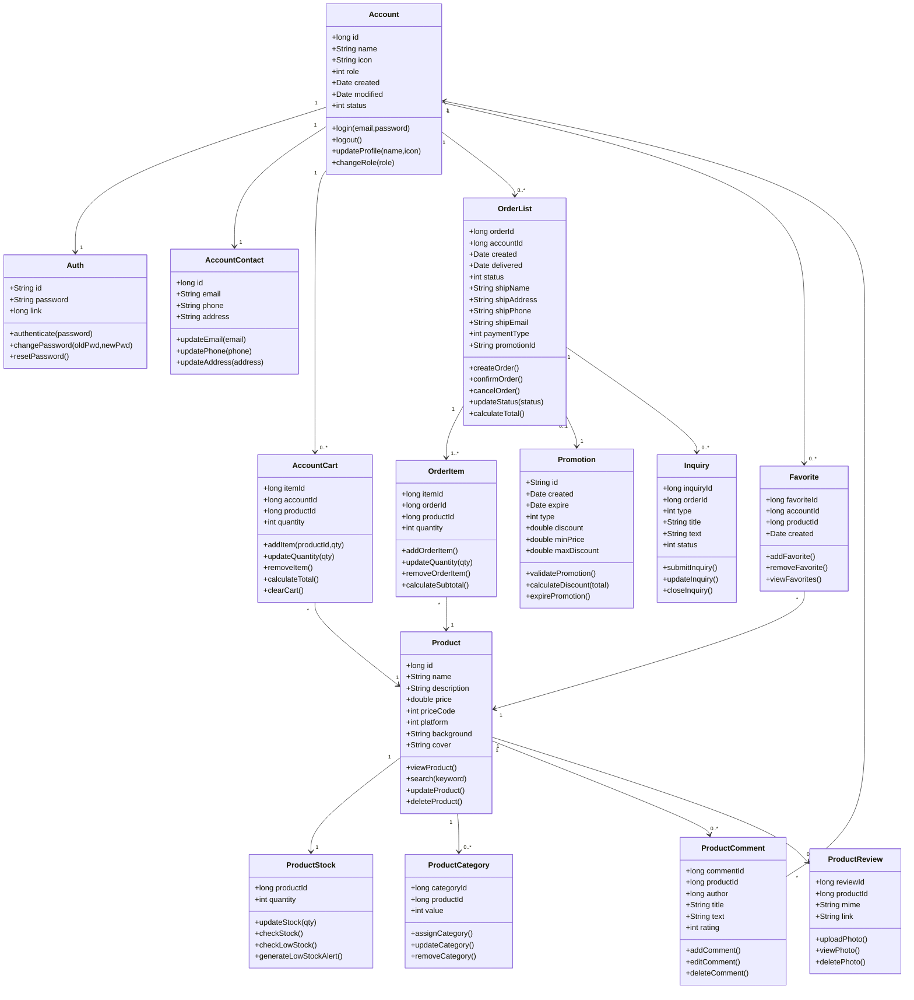
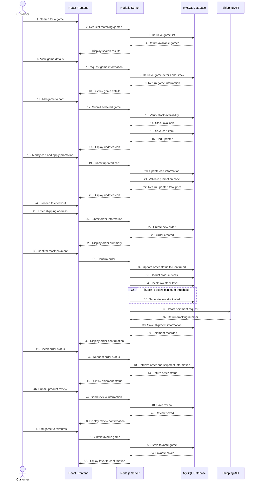
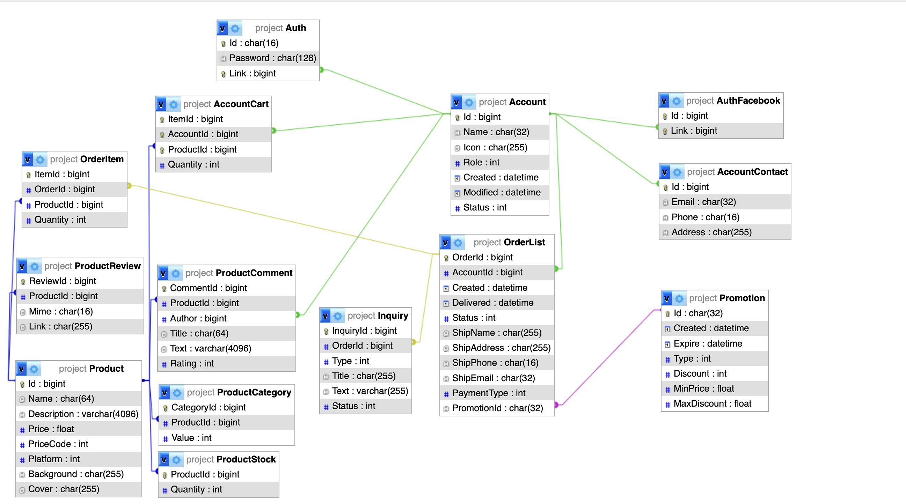

<!--  -->

<!-- > ⚠☢💥 กิตนี้บังคับปล่อย (force push) เพื่อลองของใหม่ ๆ (แม้ว่ามันจะพัง) 
> ผมจะไม่รับผิดชอบใด ๆ เลยนะถ้าระบบนี้ทำให้เกิดสงครามโลกครั้งที่ 3
> ถือว่าเตือนแล้วนะ! -- iKla47 -->

# 🏷️ ระบบเว็บไซต์ขายแผ่นและตลับเกม

- 67168514 ปิยะบุตร อิ่มทอง - [iKla47](https://github.com/iKla47) 
  (Customer / Database Administrator)
- 67163266 สิรภพ อ่วมแก้ว - [SiRaCCC](https://github.com/SiRaCCC)
  (Staff)
- 67117502 ชนันธร สะอาดจินดา - [chananthornsaa](https://github.com/chananthornsaa)
  (Project Manager / System Analyst)
- 67151039 ณัฐดนัย แสงศรี - [Beky0mi](https://github.com/Bek0saMa) 
  (Customer)
- 67173119 สุวิจักขณ์ ทัพเจริญ - [straycatalwaysstay](https://github.com/TimeSuwichak)
  (Manager)

## หลักการและเหตุผล (Relationable)

ในปัจจุบันอุตสาหกรรมเกมมีการเติบโตอย่างต่อเนื่อง แม้ว่าการซื้อขายเกมในรูปแบบดิจิทัลดาวน์โหลด (Digital Download) จะได้รับความนิยม แต่ความต้องการในการซื้อขายแผ่นเกมและตลับเกมในรูปแบบรูปธรรม (Physical Copy) ทั้งในกลุ่มเกมเมอร์ยุคใหม่และกลุ่มนักสะสมเกมคลาสสิก (Retro Gamers) ยังคงมีมูลค่าการตลาดที่สูงมาก ปัญหาที่พบในปัจจุบันคือ ร้านขายแผ่นเกมส่วนใหญ่อาจยังไม่มีระบบการจัดการสินค้าออนไลน์ที่มีประสิทธิภาพเพียงพอ หรือแพลตฟอร์ม E-commerce ทั่วไปไม่มีการจัดหมวดหมู่ที่ตอบโจทย์เฉพาะกลุ่มผู้เล่นและนักสะสม เช่น การระบุแพลตฟอร์ม (Platform), โซนของแผ่นเกม (Zone), แนวเกม (Genre) และความหายากของตลับเกมเก่าอย่างชัดเจน

นอกจากนี้ การบริหารจัดการหลังร้านสำหรับผู้ประกอบการยังมีความยุ่งยากในการตัดสต็อก การติดตามสถานะการจัดส่ง และการสรุปยอดขาย ดังนั้น ผู้จัดทำจึงมีแนวคิดที่จะพัฒนา "ระบบร้านขายแผ่นและตลับเกม" ซึ่งเป็นระบบ E-Commerce ที่ออกแบบมาเพื่อตอบสนองความต้องการของร้านขายเกมโดยเฉพาะ เพื่ออำนวยความสะดวกให้แก่ลูกค้าในการค้นหาและสั่งซื้อสินค้า และช่วยให้พนักงานและผู้จัดการสามารถบริหารจัดการสินค้า สต็อก ออเดอร์ และดูรายงานยอดขายได้อย่างเป็นระบบและมีประสิทธิภาพสูงสุด

## วัตถุประสงค์ของโครงงาน (Objectives)

1. เพื่อพัฒาระบบพาณิชย์อิเล็กทรอนิกส์ (E-Commerce) สำหรับร้านขายแผ่นและตลับเกม ทั้งแพลตฟอร์มยุคปัจจุบันและยุคคลาสสิก
2. เพื่อสร้างระบบการจัดการข้อมูลสินค้า (Product Management) ที่สามารถแบ่งหมวดหมู่และรายละเอียดเฉพาะของแผ่นและตลับเกมได้อย่างเป็นระบบ
3. เพื่อพัฒนาระบบจัดการคำสั่งซื้อ (Order Management) และจำลองการติดตามสถานะการจัดส่งพัสดุ (Mock Shipping API) ที่ช่วยให้กระบวนการซื้อขายครบวงจร
4. เพื่อสร้างระบบรายงานยอดขาย (Revenue Dashboard) สำหรับผู้บริหาร เพื่อนำข้อมูลไปใช้ในการวิเคราะห์และวางแผนการตลาด
5. เพื่อศึกษาและประยุกต์ใช้ความรู้ด้านการพัฒนาระบบซอฟต์แวร์ตามวงจรการพัฒนาระบบ (SDLC) ในสถานการณ์จำลองจริง

## ขอบเขตของระบบ (System Scope) 

ผู้ใช้งาน (Actors) และความสามารถหลักของระบบ (Main Functions):

1. ลูกค้า (Customer) - ผู้ซื้อ

- ระบบสมาชิก (Register / Login)

- ระบบค้นหาและคัดกรองสินค้าแบบละเอียด (Advanced Filter)

- ระบบรายการสินค้าที่ชอบ (Add / Delete)

- ระบบตะกร้าสินค้า (Add / Edit / Delete)

- ระบบการชำระเงิน (Mock Payment)

- ระบบติดตามสถานะการจัดส่งพัสดุ (Mock Shipping API)

- ระบบรายงานสินค้า

2. พนักงาน (Staff) - ผู้ดูแลการจัดส่งสต็อกและออเดอร์

- ระบบเข้าสู่ระบบ (Login)

- ระบบจัดการข้อมูลสินค้าและสต็อก (Add / Edit)

- ระบบจัดการคำสั่งซื้อและอัปเดตสถานะการจัดส่ง (Edit / Update)

- ระบบรับเรื่องรีพอร์ตเกี่ยวกับสินค้า

3. ผู้จัดการ (Manager) - ผู้ดูแลระบบ / Admin

- ระบบเข้าสู่ระบบ (Login)

- ระบบรายงานยอดขายและสถิติ (Revenue Dashboard) - ดูภาพรวมรายได้ ดูสถิติคำสั่งซื้อ สัดส่วนยอดขายตามแพลตฟอร์ม และอันดับเกมขายดี 

- ระบบแจ้งเตือนสินค้าใกล้หมดสต็อก (Low Stock Alert System)

- ระบบจัดการบัญชีผู้ใช้งาน (User Management) - จัดการบัญชีของพนักงานและลูกค้า (Add / Edit / Delete)

- ระบบจัดการโปรโมชันและคูปองส่วนลด (Promotions & Coupons) (Add / Edit / Delete)

- ระบบตั้งค่าข้อมูลหลักของร้าน (System Settings) - จัดการหมวดหมู่ แพลตฟอร์ม และแนวเกม (Add / Edit / Delete)

- สิทธิ์การทำงานครอบคลุมพนักงาน (Staff Override) - สามารถจัดการข้อมูลสินค้า สต็อก และคำสั่งซื้อได้ทั้งหมด (Add / Edit / Delete / Update) 


## แนวทางการพัฒนาตาม SDLC (System Development Life Cycle)

| ขั้นตอน (Phase) | รายละเอียดโดยย่อ (Brief Description) | 
|---|---|
| 1.Planing | วิเคราะห์ความต้องการและกำหนดขอบเขตของระบบ | 
| 2.Analysis | วิเคราะห์กระบวนการทำงานและจำลองระบบ (Use Case, ER-Diagram) |
| 3.Design | ออกแบบสถาปัตยกรรมระบบ ฐานข้อมูล และหน้าจอผู้ใช้งาน (UI/UX) |
| 4.Development	| พัฒนา Frontend ด้วย React และ HTML/CSS พร้อมพัฒนา Backend API ด้วย Node.js โดยควบคุมเวอร์ชั่นโค้ดผ่าน GitHub |
| 5.Testing	| ทดสอบการทำงานแบบ Manual Testing, ตรวจสอบ API ด้วย Postman และทำการทดสอบการยอมรับของผู้ใช้ |
| 6.Deployment | นำระบบขึ้นเผยแพร่ (Deploy) ให้ใช้งานได้จริง |
| 7.Maintenance	| บำรุงรักษาและปรับปรุงระบบตามข้อเสนอแนะ |

## 🛠️ เครื่องมือและเทคโนโลยี (Tools & Technologies)

*(รายการนี้สถานะไม่คงที่ และอาจเปลี่ยนแปลงได้ในอนาคต)*

ส่วนหน้า (Frontend)

- NodeJS: รันไทม์สำหรับภาษาโปรแกรม JavaScript (ใช้ระหว่างพัฒนา)
- TypeScript: ภาษาเพิ่มเติมจาก JavaScript 
  ที่ช่วยจับข้อผิดพลาดผ่าน Type-Checking และ Interface
- Vite: เครื่องมือในการสร้างเว็บไซต์และรันเซิร์ฟเวอร์ในระหว่างการพัฒนา (Development Server),
- React: ไลบรารีอำนวยความสะดวกในการสร้าง UI ผ่านแนวคิดส่วนประกอบ (Component)
- Styled Components: อำนวยความสะดวกในการใช้งาน CSS ร่วมกับ React
- ESLint: ตรวจจับความผิดพลาดเชิงตรรกะในโค้ด


ส่วนหลัง (Backend)

- Node.js: รันไทม์สำหรับภาษาโปรแกรม JavaScript
- TypeScript: ภาษาเพิ่มเติมจาก JavaScript 
  ที่ช่วยจับข้อผิดพลาดผ่าน Type-Checking และ Interface
- Express: ระบบจัดการเชื่อมต่อระหว่างผู้ใช้บน HTTP/HTTPS
- Express RateLimit: เพิ่มการจำกัดเข้าถึงทรัพยากรบนเซิร์ฟเวอร์ด้วยช่วงเวลา
- Cors: เพิ่มการจำกัดเข้าถึงทรัพยากรบนเซิร์ฟเวอร์กับผู้ใช้บางส่วน
- Compression: เพิ่มการบีบอัดข้อมูลระหว่างการเชื่อมต่อกับเซิร์ฟเวอร์
- ESLint: ตรวจจับความผิดพลาดเชิงตรรกะในโค็ด
- Nodemon: อำนวยความสำดวกในการพัฒนาระบบ

ส่วนข้อมูล (Database)

- MySQL: สำหรับการจัดเก็บข้อมูลผู้ใช้, ข้อมูลสินค้า, ข้อมูลชำระเงิน,
  ข้อมูลจัดส่ง, ประวัติ, และรวมไปถึงกิจกรรมระบบ

- ส่วนออกแบบ (Design Tool)
  - Draw.io: ใช้งานสำหรับการเขียนวาดภาพไดอะแกรม 
    Use Cases Diagram, Sequences Diagram 

## แนวทางการทดสอบ (Testing Approach)

ประเภทการทดสอบ (Test Types): 
- Functional Testing
-	User Acceptance Testing (UAT)
เครื่องมือที่ใช้ (Tools):
-	Postman (สำหรับทดสอบ API)
-	Manual Testing (ทดสอบการทำงานของระบบด้วยตนเองตามฟังก์ชันที่พัฒนา)

## ผลลัพธ์ที่คาดว่าจะได้รับ (Expected Outcomes)

1.	ได้ระบบร้านขายแผ่นและตลับเกม (E-Commerce) ที่สามารถใช้งานได้จริงผ่านเว็บเบราว์เซอร์
2.	ลูกค้าสามารถค้นหาสินค้า สั่งซื้อ และติดตามสถานการณ์จัดส่งได้อย่างสะดวกและรวดเร็ว
3.	พนักงานมีเครื่องมือที่ช่วยในการจัดการสต็อกสินค้าและสถานะคำสั่งซื้อได้อย่างถูกต้องแม่นยำ ลดข้อผิดพลาดในการทำงานผู้จัดการมีระบบสรุปข้อมูลยอดขาย (Dashboard) ที่แสดงผลแบบภาพรวม ช่วยในการตัดสินใจทางธุรกิจ
4.	ผู้จัดทำโครงงานได้รับทักษะและประสบการณ์ตรงในการพัฒนาระบบแบบ Full-stack และเข้าใจกระบวนการทำงานแบบวิศวกรรมซอฟต์แวร์

## แผนการดำเนินงาน 4 สัปดาห์ (Work Plan: 4 Weeks)

| สัปดาห์ (Week) | กิจกรรม (Activities) | รายละเอียดโดยย่อ (Brief Description) |
|---|---|---|
| 1 | วิเคราะห์และออกแบบระบบ (Analysis & Design) | วิเคราะห์ความต้องการของระบบ ออกแบบ Use Case, ER-Diagram และ UI/UX |
| 2 | พัฒนา Frontend (Frontend Development)|	พัฒนาหน้าจอผู้ใช้ส่วนหน้าโดยใช้ React | 
| 3 | พัฒนา Backend และฐานข้อมูล (Backend & Database Development)| สร้าง API จัดการสินค้า, เชื่อมต่อ API สำหรับชำระเงิน และทำ Mock Shipping |
| 4 | ทดสอบระบบและนำเสนอผลงาน (Testing & Presentation) |ทำ Manual Testing/UAT ตรวจสอบบัค และเตรียมพรีเซนต์โปรเจกต์ |

## หลักการออกแบบสถาปัตยกรรมซอฟต์แวร์ (Software Architectural Design Principles)

-	Client-Server Architecture: แยกการทำงานระหว่างส่วนแสดงผล (Frontend) และส่วนประมวลผล (Backend) ออกจากกันอย่างชัดเจน เพื่อให้ระบบสามารถบำรุงรักษาและขยายสเกล (Scalability) ได้ง่ายในอนาคต

-	RESTful API Integration: การสื่อสารข้อมูลระหว่าง Frontend และ Backend จะใช้มาตรฐาน API เป็นตัวกลางในการส่งผ่านข้อมูล

-	Relational Data Structure: ออกแบบโครงสร้างข้อมูลที่เน้นความสัมพันธ์ของเอนทิตี (Entity) ผ่านการจำลองระบบด้วย ER-Diagram เพื่อให้การจัดเก็บข้อมูลสินค้า หมวดหมู่ แพลตฟอร์ม และคำสั่งซื้อมีความเป็นระบบและลดความซ้ำซ้อน 

## การออกแบบสถาปัตยกรรมระบบ (System Architecture Design)

ระบบถูกแบ่งออกเป็น 4 ส่วนหลัก เพื่อให้การประมวลผลสอดคล้องกับแนวทางการพัฒนาซอฟต์แวร์ ดังนี้:

ระบบถูกแบ่งออกเป็น 4 ส่วนหลัก เพื่อให้การประมวลผลสอดคล้องกับแนวทางการพัฒนาซอฟต์แวร์ ดังนี้:

1. Frontend Architecture (ส่วนติดต่อผู้ใช้งาน)

•	หน้าที่: ทำหน้าที่แสดงผลหน้าจอผู้ใช้งาน (UI/UX) และรับคำสั่งจากผู้ใช้งานทั้ง 3 กลุ่มผ่านเว็บเบราว์เซอร์ 

•	เทคโนโลยีที่ใช้: พัฒนาด้วย React ร่วมกับ HTML/CSS 

2. Backend Architecture (ส่วนประมวลผลหลัก)

•	หน้าที่: ควบคุมตรรกะทางธุรกิจ (Business Logic) เช่น การคำนวณเงินในตะกร้าสินค้า การตรวจสอบสิทธิ์การเข้าใช้งาน (Authentication) และการจัดการคำสั่งซื้อ พร้อมทั้งควบคุมเวอร์ชันของโค้ดผ่าน GitHub 

•	เทคโนโลยีที่ใช้: พัฒนา Backend API ด้วย Node.js

3. Database Architecture (ระบบจัดเก็บข้อมูล)

•	หน้าที่: จัดเก็บข้อมูลทุกอย่างในระบบ เช่น ข้อมูลผู้ใช้ สินค้า สต็อก และออเดอร์ 

•	เทคโนโลยีที่ใช้: เชื่อมต่อฐานข้อมูล MySQL

4. External Services (บริการภายนอก)

•	หน้าที่: บริการภายนอกที่นำมาเชื่อมต่อเพื่อเติมเต็มฟังก์ชันของ E-Commerce ให้กระบวนการซื้อขายครบวงจร 

•	เทคโนโลยีที่ใช้: Mock Shipping API สำหรับจำลองการอัปเดตและติดตามสถานะการจัดส่งพัสดุ 

| ID             | ระบบ/ฟีเจอร์ (Feature)                   | ผู้ใช้งาน (Actor)          | คำอธิบาย (Description)                                                                                                    |
| -------------- | ---------------------------------------- | -------------------------- | ------------------------------------------------------------------------------------------------------------------------- |
| **FR-AUTH-01** | สมัครสมาชิก (Register)                   | ลูกค้า                     | ผู้ใช้งานสามารถกรอกข้อมูลส่วนตัวเพื่อสร้างบัญชีใหม่ในระบบได้                                                              |
| **FR-AUTH-02** | เข้าสู่ระบบ (Login)                      | ลูกค้า, พนักงาน, ผู้จัดการ | ผู้ใช้งานเข้าสู่ระบบด้วย Username และ Password โดยระบบจะตรวจสอบสิทธิ์และนำไปยังหน้าจอตามบทบาท (Role-based Access Control) |
| **FR-PROD-01** | จัดการข้อมูลสินค้า                       | พนักงาน                    | พนักงานสามารถเพิ่ม แก้ไข และลบข้อมูลเกม รวมถึงอัปเดตแพลตฟอร์ม หมวดหมู่ ราคา รายละเอียด และจำนวนสินค้าในคลัง               |
| **FR-PROD-02** | ค้นหาและกรองสินค้า                       | ลูกค้า                     | ลูกค้าสามารถค้นหาสินค้าตามชื่อเกม และกรองสินค้าตามแพลตฟอร์ม หมวดหมู่ และช่วงราคา                                          |
| **FR-CART-01** | จัดการตะกร้าสินค้า                       | ลูกค้า                     | ลูกค้าสามารถเพิ่มสินค้า แก้ไขจำนวน หรือลบสินค้าออกจากตะกร้า พร้อมคำนวณยอดรวมและส่วนลดอัตโนมัติ                            |
| **FR-CART-02** | รายการโปรด (Favorite)                    | ลูกค้า                     | ลูกค้าสามารถเพิ่มหรือลบเกมออกจากรายการโปรดเพื่อกลับมาดูภายหลังได้                                                         |
| **FR-ORD-01**  | สร้างคำสั่งซื้อ                          | ลูกค้า                     | ลูกค้าสามารถยืนยันการสั่งซื้อ ระบุที่อยู่จัดส่ง และยืนยันการชำระเงินแบบจำลอง (Mock Payment) เพื่อสร้างคำสั่งซื้อ          |
| **FR-ORD-02**  | ตัดสต็อกอัตโนมัติ                        | ระบบ (System)              | เมื่อคำสั่งซื้อได้รับการยืนยัน ระบบจะตัดจำนวนสินค้าในคลังโดยอัตโนมัติ                                                     |
| **FR-ORD-03**  | ติดตามสถานะคำสั่งซื้อ                    | ลูกค้า                     | ลูกค้าสามารถตรวจสอบสถานะคำสั่งซื้อและสถานะการจัดส่งได้จากหน้าประวัติการสั่งซื้อ                                           |
| **FR-STF-01**  | จัดการคำสั่งซื้อ                         | พนักงาน                    | พนักงานสามารถตรวจสอบคำสั่งซื้อ ยืนยันคำสั่งซื้อ และอัปเดตสถานะการจัดส่งสินค้า                                             |
| **FR-STK-01**  | จัดการสต็อกสินค้า                        | พนักงาน                    | พนักงานสามารถเพิ่ม แก้ไข และอัปเดตจำนวนสินค้าคงเหลือในระบบ                                                                |
| **FR-STK-02**  | แจ้งเตือนสินค้าใกล้หมด (Low Stock Alert) | ระบบ (System)              | ระบบจะตรวจสอบจำนวนสินค้าคงเหลือและแจ้งเตือนเมื่อจำนวนต่ำกว่าค่าขั้นต่ำที่กำหนด                                            |
| **FR-REV-01**  | รีวิวสินค้า                              | ลูกค้า                     | ลูกค้าสามารถให้คะแนน รีวิว และแนบรูปภาพหลังจากได้รับสินค้าแล้ว                                                            |
| **FR-API-01**  | จำลองการจัดส่งสินค้า                     | ระบบ (System)              | ระบบเชื่อมต่อกับ Mock Shipping API เพื่อสร้างข้อมูลการจัดส่งและอัปเดตสถานะพัสดุ                                           |
| **FR-MGR-01**  | จัดการโปรโมชั่น                          | ผู้จัดการ                  | ผู้จัดการสามารถสร้าง แก้ไข และลบโปรโมชั่นหรือส่วนลดสำหรับสินค้าได้                                                        |
| **FR-MGR-02**  | จัดการผู้ใช้งาน                          | ผู้จัดการ                  | ผู้จัดการสามารถดู แก้ไข และจัดการบัญชีผู้ใช้งานในระบบได้                                                                  |
| **FR-MGR-03**  | รายงานยอดขาย (Dashboard)                 | ผู้จัดการ                  | ระบบแสดงข้อมูลยอดขาย รายได้ และสถิติคำสั่งซื้อในรูปแบบ Dashboard เพื่อใช้ในการวิเคราะห์ภาพรวมของธุรกิจ                    |

## แผนภาพ

### Use Case Diagram


### Class Diagram



### Sequence Diagram

1. Customer


2. Staff

```Mermaid
sequenceDiagram
    actor Staff
    participant Frontend as React Frontend
    participant Backend as Node.js Server
    participant DB as MySQL Database

    %% Order Management
    Staff->>Frontend: 1. Open Order Management
    Frontend->>Backend: 2. Request orders awaiting confirmation
    Backend->>DB: 3. Retrieve pending orders
    DB-->>Backend: 4. Return order list
    Backend-->>Frontend: 5. Display orders

    Staff->>Frontend: 6. View order details
    Frontend->>Backend: 7. Request order information
    Backend->>DB: 8. Retrieve order details
    DB-->>Backend: 9. Return order information
    Backend-->>Frontend: 10. Display order details

    Staff->>Frontend: 11. Update order status
    Frontend->>Backend: 12. Submit updated order status
    Backend->>DB: 13. Save new order status
    DB-->>Backend: 14. Status updated
    Backend-->>Frontend: 15. Display confirmation

    %% Inventory Management
    Staff->>Frontend: 16. Open Inventory Management
    Frontend->>Backend: 17. Request inventory list
    Backend->>DB: 18. Retrieve inventory
    DB-->>Backend: 19. Return inventory
    Backend-->>Frontend: 20. Display inventory

    Staff->>Frontend: 21. Update stock quantity
    Frontend->>Backend: 22. Submit stock update
    Backend->>DB: 23. Update product stock
    Backend->>DB: 24. Check low stock threshold

    alt Stock is below minimum threshold
        Backend->>DB: 25. Generate low stock alert
    end

    DB-->>Backend: 26. Stock updated
    Backend-->>Frontend: 27. Display updated inventory

    %% Customer Inquiry
    Staff->>Frontend: 28. Open Customer Inquiries
    Frontend->>Backend: 29. Request inquiry list
    Backend->>DB: 30. Retrieve inquiries
    DB-->>Backend: 31. Return inquiries
    Backend-->>Frontend: 32. Display inquiry list

    Staff->>Frontend: 33. Respond to inquiry
    Frontend->>Backend: 34. Submit inquiry response
    Backend->>DB: 35. Save response and update inquiry status
    DB-->>Backend: 36. Inquiry updated
    Backend-->>Frontend: 37. Display confirmation
```

3. Manager

```Mermaid
sequenceDiagram
    actor Manager
    participant Frontend as React Frontend
    participant Backend as Node.js Server
    participant DB as MySQL Database

    %% Order Management (Override Staff)
    Manager->>Frontend: 1. Open Order Management
    Frontend->>Backend: 2. Request orders awaiting confirmation
    Backend->>DB: 3. Retrieve pending orders
    DB-->>Backend: 4. Return order list
    Backend-->>Frontend: 5. Display orders

    Manager->>Frontend: 6. Update order status
    Frontend->>Backend: 7. Submit updated order status
    Backend->>DB: 8. Save order status
    DB-->>Backend: 9. Status updated
    Backend-->>Frontend: 10. Display confirmation

    %% Inventory Management (Override Staff)
    Manager->>Frontend: 11. Open Inventory Management
    Frontend->>Backend: 12. Request inventory
    Backend->>DB: 13. Retrieve inventory
    DB-->>Backend: 14. Return inventory
    Backend-->>Frontend: 15. Display inventory

    Manager->>Frontend: 16. Update stock quantity
    Frontend->>Backend: 17. Submit stock update
    Backend->>DB: 18. Update stock
    Backend->>DB: 19. Check low stock threshold

    alt Stock is below minimum threshold
        Backend->>DB: 20. Generate low stock alert
    end

    DB-->>Backend: 21. Stock updated
    Backend-->>Frontend: 22. Display updated inventory

    %% Customer Inquiry (Override Staff)
    Manager->>Frontend: 23. Open Customer Inquiries
    Frontend->>Backend: 24. Request inquiry list
    Backend->>DB: 25. Retrieve inquiries
    DB-->>Backend: 26. Return inquiries
    Backend-->>Frontend: 27. Display inquiry list

    Manager->>Frontend: 28. Respond to inquiry
    Frontend->>Backend: 29. Submit inquiry response
    Backend->>DB: 30. Save response
    DB-->>Backend: 31. Inquiry updated
    Backend-->>Frontend: 32. Display confirmation

    %% Product Management
    Manager->>Frontend: 33. Open Product Management
    Frontend->>Backend: 34. Request product list
    Backend->>DB: 35. Retrieve products
    DB-->>Backend: 36. Return products
    Backend-->>Frontend: 37. Display products

    Manager->>Frontend: 38. Add, edit, or delete product
    Frontend->>Backend: 39. Submit product information
    Backend->>DB: 40. Save product changes
    DB-->>Backend: 41. Product updated
    Backend-->>Frontend: 42. Display updated product list

    %% User Management
    Manager->>Frontend: 43. Open User Management
    Frontend->>Backend: 44. Request user list
    Backend->>DB: 45. Retrieve users
    DB-->>Backend: 46. Return user list
    Backend-->>Frontend: 47. Display users

    Manager->>Frontend: 48. Update user information or role
    Frontend->>Backend: 49. Submit user changes
    Backend->>DB: 50. Save user changes
    DB-->>Backend: 51. User updated
    Backend-->>Frontend: 52. Display updated users

    %% Promotion Management
    Manager->>Frontend: 53. Open Promotion Management
    Frontend->>Backend: 54. Request promotion list
    Backend->>DB: 55. Retrieve promotions
    DB-->>Backend: 56. Return promotions
    Backend-->>Frontend: 57. Display promotions

    Manager->>Frontend: 58. Create, edit, or delete promotion
    Frontend->>Backend: 59. Submit promotion changes
    Backend->>DB: 60. Save promotion changes
    DB-->>Backend: 61. Promotion updated
    Backend-->>Frontend: 62. Display updated promotions

    %% Sales Dashboard
    Manager->>Frontend: 63. Open Sales Dashboard
    Frontend->>Backend: 64. Request sales summary
    Backend->>DB: 65. Retrieve sales reports
    DB-->>Backend: 66. Return sales data
    Backend-->>Frontend: 67. Display sales dashboard
```

### Data Schema (JSON)


### Wireframe / Prototype

https://www.figma.com/design/4axEENmLrWcVgOkUc0Uxis/Untitled?node-id=0-1&t=HhGGfBS68qEH2CRZ-1
